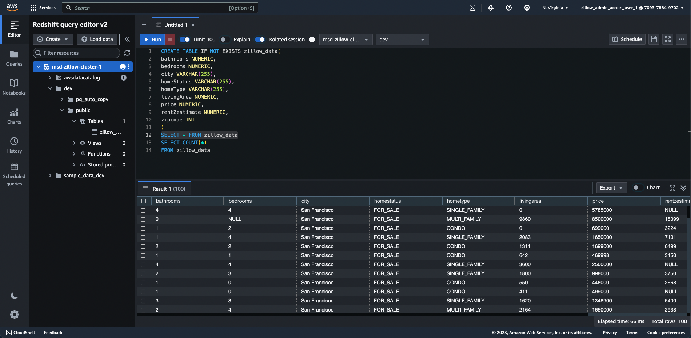

# Zillow Rapid API Data Pipeline Project

This project is an end-to-end data pipeline hosted on an AWS EC2 Instance that uses Airflow DAGS to pull proxy Zillow real estate data from Rapid API.

Once pulled from Rapid API, the proxy Zillow data is pulled and transformed through a series of AWS S3 buckets before ultimately being stored and visualized in AWS Redshift and AWS Quicksight, respectively.

Project composed with aid from the tutorial ["Zillow Data Analytics (RapidAPI) | End-To-End Python ETL Pipeline | Data Engineering Project"](https://www.youtube.com/watch?v=j_skupZ3zw0) by Yemi Olani.

### Airflow DAGS Graph

### AWS S3 Bucket with Rapid API Data

### AWS Redshift Table Creation

### AWS QuickSight Visualization

